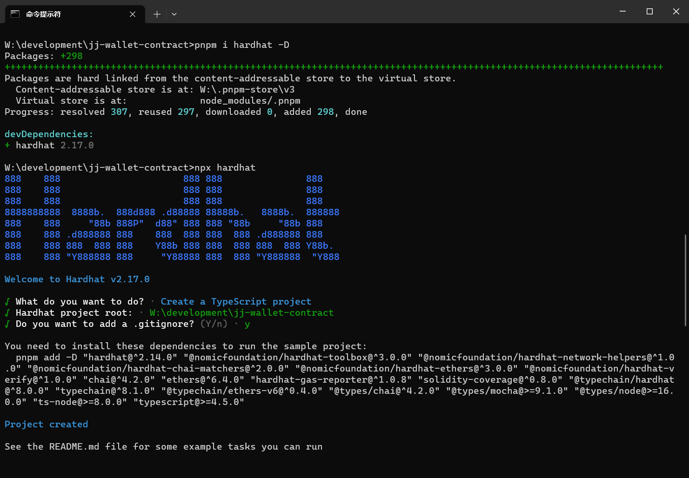

# Sample Hardhat Project

This project demonstrates a basic Hardhat use case. It comes with a sample contract, a test for that contract, and a script that deploys that contract.

Try running some of the following tasks:

```shell
npx hardhat help
npx hardhat test
REPORT_GAS=true npx hardhat test
npx hardhat node
npx hardhat run scripts/deploy.ts
```

# 关于项目的创建

```shell
# 创建 pkg.json
npm init -y

# 创建 hardhat 项目（选择 ts 项目）
npx hardhat

# 创建完成，如截图所示会有提示你去安装剩余的依赖包，跟着做就好了
npm i -D xxxxxxx
```

